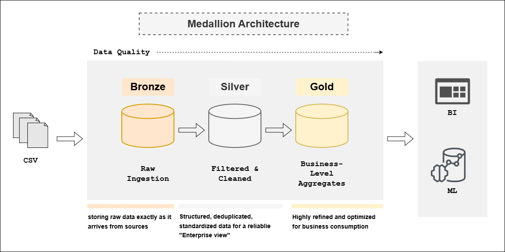
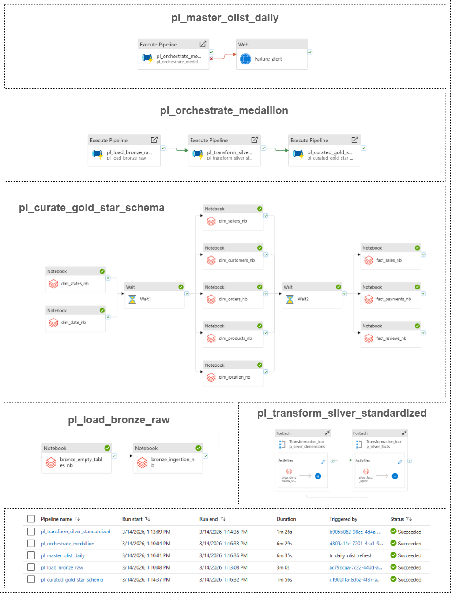

# Olist Azure Medallion Lakehouse

## 📋 Project Overview
This project implements an end-to-end Data Lakehouse architecture on Microsoft Azure using the Olist Brazilian E-Commerce dataset. It follows the Medallion Architecture (Bronze → Silver → Gold) to transform raw CSV data into analytics-ready Star Schema models optimized for reporting and downstream machine learning.

The solution emphasizes production-grade orchestration, parallel processing, strict schema enforcement, and centralized failure handling.

---

## 🏗️ Architecture Diagram


### **The Data Journey:**
1. **Bronze (Raw):** Ingests raw CSV files into ADLS Gen2, preserving the data in its original state.
2. **Silver (Cleaned):** Handles schema enforcement, deduplication, and data type standardization using **Azure Databricks (PySpark)**.
3. **Gold (Curated):** Models the data into a **Star Schema** (Fact and Dimension tables) optimized for high-performance BI reporting.

---

## 🛠️ Tech Stack
* **Storage:** Azure Data Lake Storage (ADLS) Gen2
* **Format:** Delta Lake (Parquet with Transaction Logs)
* **Orchestration:** Azure Data Factory (ADF)
* **Compute:** Azure Databricks (Apache Spark / PySpark)
* **Alerting:** Azure Logic Apps (HTML Email Notifications)
* **CI/CD:** GitHub Actions / Git Integration

---

## 💡 Key Engineering Features

### **1. Advanced Historical Tracking (SCD Type 2)**
Unlike basic overwrite pipelines, this architecture tracks the lifecycle of customers, sellers, and products.
* **Epoch Strategy:** Implemented a `1900-01-01` start-date for initial loads. This ensures historical orders (2016-2018) correctly join with dimension records.
* **Surrogate Keys:** Generated unique MD5 hashes based on the Natural ID and Start Date, enabling the Fact table to perform "Point-in-Time" lookups.


### **2. Multi-Level Orchestration**
The pipeline uses a structured orchestration hierarchy:
* **Master Pipeline:** The "Guardian" that triggers the flow and handles global error catching.
* **Sub-Orchestrator:** Manages the sequential flow (Bronze → Silver → Gold).
* **Worker Pipelines:** Executes the actual Databricks notebooks. The Gold layer is designed to run 
* **Fact and Dimension tables in parallel**, optimizing cluster utilization and reducing execution time.


### **3. Centralized Failure Handling & Smart Alerting**
Instead of manual log monitoring, I built a custom monitoring system. If any notebook fails at the "Worker" level:
* The error "bubbles up" to the Master Pipeline.
* A **Web Activity** sends the specific error message and **Run ID** to an **Azure Logic App**.
* A professionally formatted **HTML email** is sent to the data team for immediate troubleshooting.


### **4. Data Integrity & Strict Schema Enforcement**

Instead of allowing schema drift:

* Incoming data is validated against predefined schemas
* Any mismatch causes immediate pipeline failure
* Prevents corruption of Silver and Gold layers
* Ensures consistent “Single Version of Truth”
* Schema-related failures trigger automated alerts for manual reconciliation.


### **5. Global Idempotency & Self-Healing Pipelines**
I implemented **Delta Lake MERGE (Upsert)** logic across **all layers** (Bronze, Silver, Gold). This ensures that the entire pipeline is idempotent—meaning it can be re-run multiple times without creating duplicate records or data inconsistencies.

```python
# Example of the Global Upsert Pattern used across all layers
# Implementation of Null-Safe Merge logic
change_condition = " OR ".join([f"NOT (target.{c} <=> source.{c})" for c in data_cols])

(dt_gold.alias("target")
 .merge(df_final.alias("source"), "target.product_key = source.product_key")
 .whenMatchedUpdateAll(condition = change_condition)
 .whenNotMatchedInsertAll()
 .execute())
```

---

## 📂 Repository Structure
```text
├── notebooks/           # Databricks PySpark notebooks (Bronze, Silver, Gold)
├── pipelines/           # Individual ADF Pipeline JSON definitions
├── infrastructure/      # Sanitized ARM Templates for Factory deployment
├── logic-app/           # Logic App JSON schema and HTML Alert template
└── README.md            # Project documentation
```

---

## 🏆 Project Impact

**Scalability:**
* Modular layer separation
* Easy onboarding of new datasets

**Reliability:**
* Automated alerting
* Retry policies
* Failure propagation strategy

**Performance:**
* Parallelized Gold processing
* Delta Lake optimization

**Maintainability:**
* Clear separation of concerns
* Idempotent pipelines
* Controlled schema governance

---

## 📸 Project Gallery

### **Orchestration Flow (ADF)**
This screenshot shows the 3-level nested hierarchy and the parallel execution of the Gold layer facts and dimensions.



---

## 👨‍💻 About Me
**Hruday Bhaskar Madanu** -
 *(Data Engineer | Former Operations Professional)*

I am an Aspiring Data Engineer focused on building scalable, production-grade data platforms using SQL, Databricks, Azure. My expertise lies in designing Medallion architectures, optimizing PySpark performance, and implementing robust orchestration patterns.

* **LinkedIn:** [linkedin.com/in/hruday-bhaskar-madanu](https://www.linkedin.com/in/hruday-bhaskar-madanu)

---

## ⚖️ License
This project is licensed under the **MIT License**.
